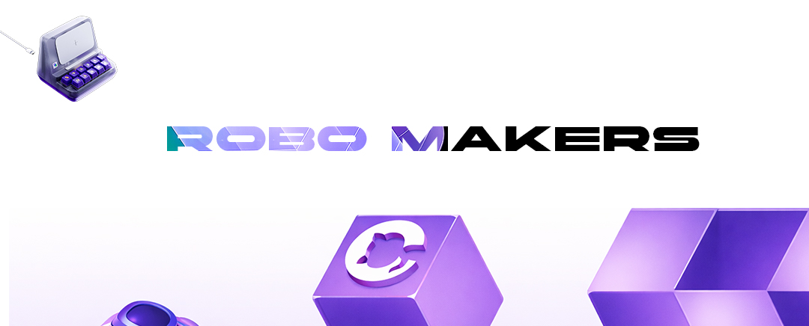

<!-- Сгенерировано EyeCode Dashboard -->

> **Группа:** Group D

### Состав группы
| ID | ФИО | Статус |
|----|-----|--------|
| #FD-250601-023 | Лев Пономарев | active |
| #FD-250201-017 | Александр Налинский | active |
| #FD-250201-327 | Никита Комаров | active |
| #FD-250201-019 | Артем | active |

---


> **Task ID:** `js-probability-01`

---
# Задание: Распределяющая шляпа
## Суть задания

Ты создашь **интерактивный генератор факультета** в стиле Гарри Поттера. Пользователь выбирает персонажа, нажимает на шляпу — и она "думает", а затем случайно распределяет его в один из четырёх факультетов: **Гриффиндор, Слизерин, Когтевран или Пуффендуй**.

Каждый факультет имеет свой цвет и девиз. Персонажи меняются кликом. Это задание про `Math.random()`, вероятности и работу с DOM.

---

## 📋 Пошаговый план

### 1️⃣ Собери структуру страницы

Страница должна содержать:
- Карточку персонажа с его **изображением** и **именем**
- Кнопку смены персонажа
- Изображение шляпы (найди в интернете `.png` с прозрачным фоном)
- Блок результата — факультет, его цвет и девиз (изначально скрыт)

Все элементы дай понятные `id`, они понадобятся в JS.

---

### 2️⃣ Подготовь данные

В `app.js` создай два массива-объекта:

**Персонажи** — минимум 6. У каждого: имя и путь к изображению. Картинки скачай сам и положи в папку `img/`.

**Факультеты** — 4 штуки. У каждого: название, цвет (hex) и короткий девиз.

> 💡 Все данные — в массивах объектов. Никаких магических строк внутри функций.

---

### 3️⃣ Сделай смену персонажей

При клике на кнопку "Следующий персонаж" — меняй текущего персонажа. Пройди по массиву по кругу: после последнего — снова первый.

Обнови картинку и имя в DOM. Результат от предыдущей шляпы при этом скрывай — новый персонаж ещё не распределён.

---

### 4️⃣ Реализуй логику шляпы

При клике на шляпу запускается три этапа:

| Этап | Что происходит |
|------|---------------|
| 1. Анимация | Шляпа "трясётся" — добавь CSS-класс с анимацией |
| 2. Пауза | `setTimeout` на 2 секунды — шляпа "думает" |
| 3. Результат | Выбирается случайный факультет через `Math.random()` |

Для выбора факультета:
```js
const index = Math.floor(Math.random() * faculties.length);
```

---

### 5️⃣ Добавь неравные вероятности

Настоящая шляпа распределяет неравномерно. Сделай так, чтобы у факультетов были **разные шансы**:

| Факультет | Шанс |
|-----------|------|
| Гриффиндор | 40% |
| Слизерин | 25% |
| Когтевран | 20% |
| Пуффендуй | 15% |

Подумай: как реализовать это через `Math.random()` и диапазоны чисел от 0 до 1?

> 💡 Это и есть теория вероятностей на практике. Запиши в README как ты это решил.

---

### 6️⃣ Покажи результат красиво

После выбора факультета:
- Появляется блок с **названием факультета** и **девизом**
- Фон или рамка блока окрашивается в **цвет факультета**
- Имя персонажа в результате тоже отображается: _"Гермиона Грангер → Гриффиндор"_

---

### 7️⃣ Статистика сессии

Внизу страницы добавь небольшой счётчик — сколько раз каждый факультет был выбран за текущую сессию. Обновляй после каждого распределения.

Это позволит студенту **визуально убедиться**, что вероятности работают правильно после многих нажатий.

---

<div align="center">
<h2>👁️ Чеклист перед сдачей</h2>

| Проверка | Статус |
|----------|--------|
| Минимум 6 персонажей с картинками | ☐ |
| Смена персонажа работает по кругу | ☐ |
| Шляпа анимируется перед результатом | ☐ |
| Факультет выбирается случайно с нужными вероятностями | ☐ |
| Цвет блока меняется под факультет | ☐ |
| Статистика сессии отображается и обновляется | ☐ |
| В README объяснено как реализованы вероятности | ☐ |
| Нет ошибок в консоли браузера | ☐ |
</div>

---

<div align="center">
<h2>📤 Как сдать</h2>

| Способ | Что делать |
|--------|------------|
| **ZIP** | Упакуй папку с `index.html`, `app.js`, `style.css` и папкой `img/` |

> ⏳ **Дедлайн:** 14 дней с момента получения задания
</div>

---

<div align="center">

### 🎓 Удачи в разработке!
**Вопросы?** Пиши в чат курса
[www.eyecodeuniversity.ru](https://www.eyecodeuniversity.ru)



</div>
